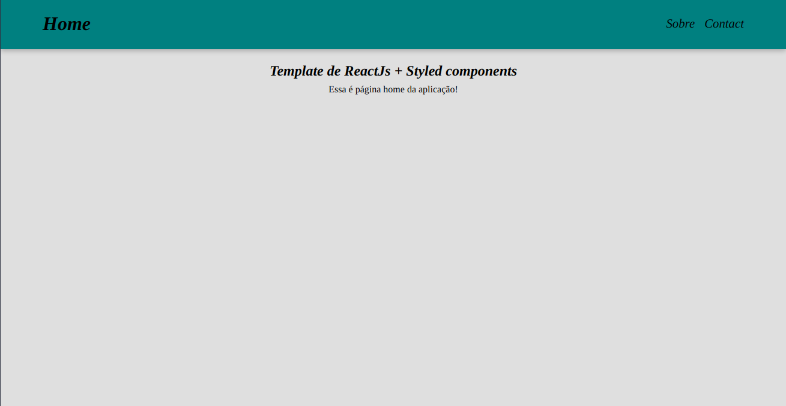

# Template ReactJs e Styled Components

> Esse template contém react-router-dom configurado, navBar linkada com as rotas/paginas e styledComponents configurado, com globalStyles.

### Ajustes e melhorias

O projeto ainda está em desenvolvimento e as próximas atualizações serão voltadas nas seguintes tarefas:

- [x] Responsividade até a resolução 768px
- [x] Styled components
- [x] React router dom
- [x] NavBar funcional
- [ ] ContextAPI
